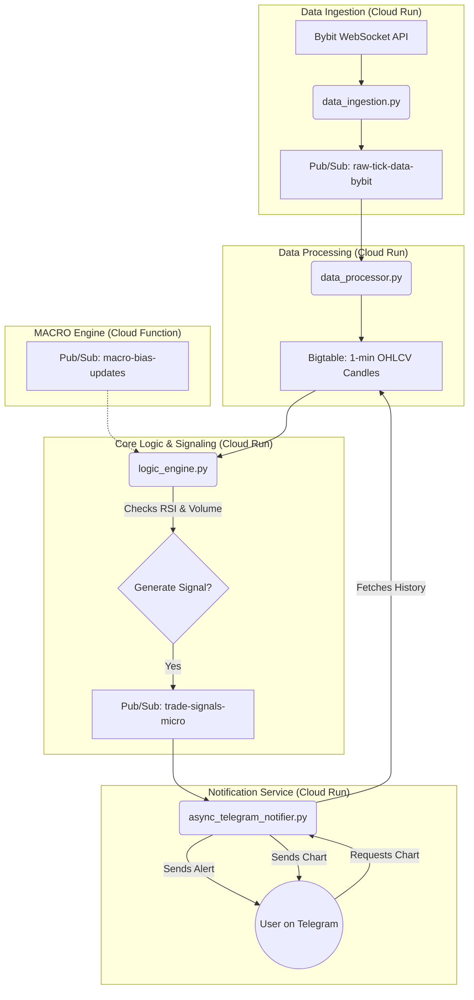

# CryptoSignalTracker: A Dual-Engine Trading Signal Platform

CryptoSignalTracker is a comprehensive, cloud-native application designed to monitor cryptocurrency markets and generate real-time trading signals. It is built around a dual-engine architecture: a **MACRO** engine for swing trading and a **MICRO-SCALP** engine for high-frequency, short-term opportunities. The entire system is built on Google Cloud Platform and delivers signals via a feature-rich Telegram bot.

---

## System Architecture

The following diagram illustrates the end-to-end data flow for the MICRO-SCALP engine, from data ingestion to signal notification.



---

## Core Components

The application consists of two main trading engines and several supporting services.

### 1. MACRO Engine (Swing Trading)

-   **Objective:** To identify longer-term swing trading opportunities based on 5-minute candle data.
-   **Technology:** Deployed as a Google Cloud Function (`run_signal_generation`), as defined in `cloudbuild.yaml`.
-   **Data Source:** Primarily designed to use the Kraken API.
-   **Integration:** Publishes its directional bias (`LONG`/`SHORT`) and confidence score to the `macro-bias-updates` Pub/Sub topic, allowing the MICRO engine to align with the broader market trend.

### 2. MICRO-SCALP Engine (High-Frequency Trading)

This is the primary focus of current development. It is designed for low-latency, high-frequency scalping and is composed of several independent services that run concurrently.

#### a. Data Ingestion (`micro_scalp_engine/data_ingestion.py`)

-   **Purpose:** Connects to the public Bybit WebSocket `trade` stream.
-   **Function:** Captures every single trade for a predefined list of symbols (e.g., BTCUSDT, ETHUSDT) in real-time.
-   **Output:** Publishes raw, unprocessed trade data as JSON messages to the `raw-tick-data-bybit` Pub/Sub topic.

#### b. Data Processor (`micro_scalp_engine/data_processor.py`)

-   **Purpose:** Consumes the raw data stream and makes it usable for analysis.
-   **Function:** Subscribes to the `raw-tick-data-bybit` topic. It aggregates the individual trades into standardized **1-minute OHLCV (Open, High, Low, Close, Volume) candles**.
-   **Output:** Writes the completed 1-minute candles to a `market-data-1m` table in Google Bigtable for persistent, low-latency storage.

#### c. Logic Engine (`micro_scalp_engine/logic_engine.py`)

-   **Purpose:** The "brain" of the scalping strategy. It analyzes the processed candle data and decides when to issue a trade signal.
-   **Function:**
    1.  Runs in a continuous loop (every 15 seconds).
    2.  Fetches the most recent 100 candles for each symbol from Bigtable.
    3.  Applies the "v5.2 Champion" strategy: checks for a combination of **RSI divergence** (oversold/overbought) and a significant **volume spike**.
    4.  If conditions are met and no position is currently open for the symbol, it calculates Take Profit and Stop Loss levels.
-   **Output:** Publishes a detailed trade signal message to the `trade-signals-micro` Pub/Sub topic.

#### d. Telegram Notifier (`micro_scalp_engine/async_telegram_notifier/main.py`)

-   **Purpose:** A sophisticated, interactive alert system that serves as the user interface.
-   **Function:**
    1.  Subscribes to the `trade-signals-micro` topic.
    2.  Sends a formatted HTML message to the designated Telegram channel for every new signal.
    3.  Provides an inline "📊 Chart" button with each new signal.
    4.  Uses **Redis** to map trade IDs to Telegram message IDs, enabling it to **edit the original message** with "EXIT" details when the trade is closed, preventing channel spam.
    5.  When the chart button is pressed, it fetches historical data from Bigtable, generates a chart `.png` using `mplfinance`, and sends it to the user.

---

## Google Cloud Services

-   **Cloud Run:** Hosts the long-running, containerized services of the MICRO-SCALP engine (Ingestion, Processing, Logic, Notifier).
-   **Cloud Functions:** Hosts the serverless MACRO engine.
-   **Pub/Sub:** The messaging backbone of the entire system, used for decoupling services and enabling asynchronous communication.
-   **Bigtable:** A high-throughput NoSQL database used to store the 1-minute candle data for fast read/write access by the logic engine and notifier.
-   **Secret Manager:** Securely stores all API keys, bot tokens, and other credentials.
-   **Cloud Build:** Manages the CI/CD pipeline, automatically building and deploying services from the repository.

---

## Local Development

To run the MICRO-SCALP engine on your local machine for testing and development:

1.  **Set up the Environment:**
    ```bash
    # Install dependencies
    pip install -r requirements.txt
    ```

2.  **Configure Authentication:**
    Ensure your local environment is authenticated with Google Cloud:
    ```bash
    gcloud auth application-default login
    ```

3.  **Run the Services:**
    The `start_services.sh` script is the recommended way to start all necessary components in the correct order. It will also handle environment variable setup for local testing.
    ```bash
    ./start_services.sh
    ```
    This script will run the data ingestion, processing, and logic engines as background processes, while the Telegram notifier runs in the foreground.

---
This README provides a comprehensive overview of the CryptoSignalTracker project. For more specific implementation details, please refer to the source code of the individual modules.

## Post-Deployment Tasks

- [ ] Enable the Container Scanning API for the Artifact Registry repository `cloud-fxn-images` to get vulnerability reports for Docker images.
  - In Google Cloud Console, go to Artifact Registry > select `cloud-fxn-images` repository > Settings tab > Artifact Analysis.

## Crypto Signal Tracker 